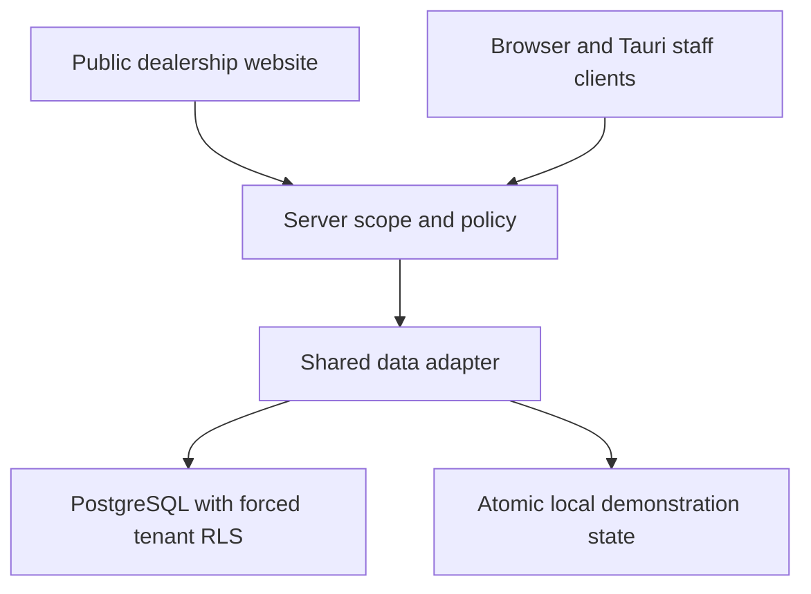

# Automobile Engine Architecture — implemented runtime

## Architecture style

Automobile Engine starts as a disciplined modular monorepo with hard domain boundaries. It is deliberately not split into microservices early. A module becomes a separate service only when independent scaling, fault isolation, deployment cadence or team ownership creates measurable value.

## Monorepo

pnpm + Turborepo coordinates three Next.js applications, a React/Tauri native staff client and shared packages.

### Applications

- **Public Experience** — SEO-oriented dealership experience, Inventory Hub discovery, vehicle detail, compare and conversion.
- **Command Center** — dealership Growth / Sales OS for leads, pipeline, customers, tasks, appointments, inventory and intelligence.
- **Platform Control Center** — VandLabs-only network operations for tenants, onboarding, entitlements, feature rollout, integrations, health and audit.

### Shared packages

- `@vandlabs/contracts` — canonical domain, capabilities and repository contracts.
- `@vandlabs/data` — shared PostgreSQL/demo repositories, scoped business mutations and deterministic inventory/capital evidence.
- `@vandlabs/server-auth` — Cognito token/session verification and server-owned staff scope resolution.
- `@vandlabs/demo-data` — reference tenant/inventory/CRM/analytics fixtures plus local demo persistence.
- `@vandlabs/design-system` — shared primitive/token foundation.

## Tenant hierarchy

```text
VandLabs
  → Organization / Dealer Group
      → Dealership / Brand
          → Location
              → Users / Inventory / Leads / Campaigns / Analytics
```

The V1 reference implementation uses strong explicit tenant/dealership/location keys in the domain model. The PostgreSQL adapter now enforces transaction-local tenant context, forced RLS, tenant-aware foreign keys and scoped server authorization. Embedded PostgreSQL and HTTP access regressions verify these boundaries. Deployed Aurora/network/recovery and future cache/search/storage isolation remain separate acceptance.

## Vehicle Inventory Hub

The canonical vehicle record owns identity, tenant/dealership/location keys, commercial facts, specifications, media, lifecycle status, source metadata and finance/exchange eligibility. Public inventory and staff inventory read the same record. External DMS/CRM/marketplace sources will be adapters/projections rather than uncontrolled sources of truth.

## Progressive customer identity

```text
Anonymous Visitor → Lead → Customer → Optional Account
```

Browsing, enquiry, WhatsApp, calls and test-drive requests do not require customer signup.

## Customer journey & attribution

The public app captures permitted source/campaign context and records page, vehicle and conversion events through the BFF contract. Leads preserve first-touch, last-touch and vehicle-interest context. The system does not claim CAC/ROAS or perfect attribution unless downstream cost/outcome evidence exists.

## CRM / Sales OS

The automotive pipeline is:

```text
NEW → CONTACTED → QUALIFIED → APPOINTMENT → VISITED → TEST DRIVE
    → NEGOTIATION → WON / LOST / NURTURE
```

Lead profiles preserve vehicle interest, acquisition context, consent, ownership, tasks and appointments. Automation and AI may assist later, but human handoff remains fundamental.

## Current request path



`DATA_MODE` selects one authoritative adapter; production never silently falls back to demonstration records. Customer enquiry scope comes from server tenant configuration. Staff capabilities/locations come from verified Cognito access and server-owned provisioning, with loopback-only demo identity for reference operation. Tokens and database/provider secrets do not reach native JavaScript or public bundles.

Inventory, lead and task mutations use record versions under transaction locks. Confirmed sales atomically record proceeds, advance lead/stock state, close open follow-ups and append audit evidence. Sale-closed tasks cannot be reopened by an ordinary task action. Stock costs have a separately authorized versioned register with atomic amendment history; no full accounting ledger is implied.

The demo adapter commits enquiries, lead changes, tasks, automation runs and activity together through one atomic document replacement and writer lock. Internal automation creates tasks with duplicate prevention; unavailable provider actions stay held and are distinguishable from missing consent. No external delivery or production job-worker execution is claimed.

Platform runtime configuration is distinct from monitored health. Illustrative tenant/onboarding/audit control-plane screens are hidden in production data mode. Production provisioning, entitlement administration, provider gateways and market ingestion remain unfinished.

## Production AWS request path

```text
Customer
  → DNS / WAF / CloudFront
  → Next.js Experience Layer
  → Next.js BFF
  → API Gateway / domain APIs
  → Aurora PostgreSQL
  → S3 / Redis / search
  → SQS + EventBridge + workers
  → analytics / observability / integrations
```

See `docs/aws-integration.md` for the migration sequence.

## Experience Engine

Brand, typography, colors, navigation, contact details, SEO defaults, entitlements and experience switches are typed tenant configuration. Premium custom components can exist without forking the shared core platform.

## Platform controls

Commercial package, entitlement and feature-rollout concerns are separate:

- **Package**: commercial bundle.
- **Entitlement**: capability the tenant may access.
- **Feature flag**: rollout control for code exposure.

The Platform Control Center also establishes managed onboarding, integration registry, health boundaries and audited VandLabs support access.

## Reliability and security direction

Production integration must add Cognito, MFA for privileged users, capability-based RBAC, server-side authorization, WAF/rate limits, signed object storage, KMS/Secrets Manager, audit logs, OpenTelemetry, PITR/versioning, retry/idempotency/DLQ patterns and tested restore procedures.

## Testing

Playwright covers the public experience, inventory, vehicle detail, compare, conversion BFF, 404 behavior, mobile overflow, Command Center and Platform Control Center. TypeScript/build/lint are orchestrated from the root. Final deployment requires the launch checklist in `docs/launch-qa.md`.

## V1 boundary

The Proof-of-Engine stops before workshop/service, parts, insurance, customer garage, native apps, advanced AI, full DMS/CRM/WhatsApp/lender/valuation integrations and fully self-service SaaS provisioning.

## Verified-sale and inventory-evidence domain

`@vandlabs/data` selects explicit demo/PostgreSQL adapters. Both expose visit scheduling/status and sale confirmation to browser and Tauri clients. Sales plus stock history are tenant-owned, with record locks/transactions in PostgreSQL and one atomic state replacement in the loopback demo. Sale confirmation changes lead, stock, follow-ups and audit records together. Sold stock is archived from owned public inventory; external reconciliation still needs an authorized connector.

The inventory intelligence view runs deterministic rules over scoped snapshots: task exceptions, missing next actions, stock validation, recorded price history and exact buyer constraints. It distinguishes record age from unknown acquisition age. It supplies no unsupported capital, margin, market or AI values. Provider-backed AI Gateway, economic ledger and permissioned market ingestion remain separate unfinished workstreams.
